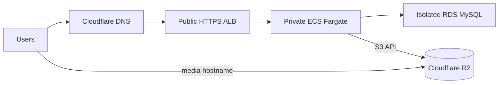

# Ghost on AWS with Terraform

A compact production-style Ghost deployment using ECS Fargate, RDS MySQL, an
HTTPS Application Load Balancer, and Cloudflare R2 for durable media.

## Architecture

AWS manages the application network, compute, database, secrets, logs, and
load balancer. Cloudflare manages DNS and the R2 bucket/custom media hostname.

## Repository

- `terraform/bootstrap` — persistent state bucket and GitHub OIDC roles
- `terraform/modules` — network, data, compute, and CI identity modules
- `terraform` — disposable Ghost application stack
- `.github/workflows` — pull-request checks, deployment, and teardown

## Prerequisites

- Terraform `>= 1.15.8`
- AWS credentials for the one-time bootstrap
- An issued ACM certificate for the Ghost hostname
- A Cloudflare R2 bucket with a custom domain
- An R2 Object Read & Write token stored in AWS Secrets Manager

The R2 secret must contain `accessKeyId` and `secretAccessKey`. Real tfvars,
state, plans, and credentials are ignored and must never be committed.

## Bootstrap once

The bootstrap root must exist before CI can authenticate or use remote state.
Configure its example variables, apply it with an administrative AWS identity,
and retain its local state. See [terraform/bootstrap](terraform/bootstrap/README.md).

Create `plan` and `production` GitHub environments. Put the shared configuration
variables in both environments: `TERRAFORM_STATE_BUCKET`, `AWS_REGION`,
`DOMAIN_NAME`, `ACM_CERTIFICATE_ARN`, `GHOST_IMAGE`, `CLOUDFLARE_ACCOUNT_ID`,
`R2_BUCKET_NAME`, `R2_MEDIA_HOSTNAME`, and `R2_CREDENTIALS_SECRET_ARN`.

Add `TERRAFORM_PLAN_ROLE_ARN` only to `plan`, and
`TERRAFORM_APPLY_ROLE_ARN` only to `production`. Keep `plan` unrestricted;
restrict `production` to `main`. Required reviewers are optional.

A pull request runs static checks and a speculative plan. A push to `main`
creates a saved production plan and stores it briefly in the private state
bucket. To deploy it, run **Terraform production deployment** on `main` with
`action=apply` and enter `APPLY`. If the saved plan has gone stale, run the
same workflow with `action=plan` first to regenerate it. Use the separate
**Terraform production destroy** workflow with `DESTROY` to tear down the
application stack.

After deployment, point the Ghost hostname at the `alb_dns_name` output. The R2
custom domain serves `/content/images`, `/content/media`, and `/content/files`.

## Operational notes

- RDS deletion protection is disabled by default for this experimental stack;
  set `allow_data_destruction = false` for a longer-lived deployment.
- Destroying the stack deletes the database without a final snapshot. Ghost
  content is not recoverable after `DESTROY`.
- The application stack can be destroyed without deleting bootstrap or R2.
- Saved plans expire from the private state bucket after two days and are
  removed immediately after a successful apply.
- ALB, NAT Gateway, RDS, Fargate, Secrets Manager, logs, and R2 can incur cost.

Not currently implemented: email delivery, payments, multi-task ECS, Multi-AZ
RDS, per-AZ NAT gateways, WAF, alarms, and automated disaster recovery.

## License

[MIT](LICENSE). Ghost is a trademark of the Ghost Foundation; this repository
deploys the official Ghost container image and does not include Ghost source.
