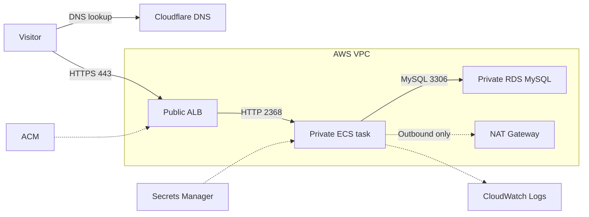

# Ghost on AWS with Terraform

A cost-conscious deployment of [Ghost](https://ghost.org/) on AWS. Terraform
runs a private ECS Fargate task behind an HTTPS Application Load Balancer, with
application data stored in RDS MySQL.

## Architecture



Cloudflare DNS is managed manually. TLS terminates at the ALB; ECS and RDS have
no public IPs.

## What is deployed

| Area | Implementation |
| --- | --- |
| Network | Two-AZ VPC with public, private application and isolated database subnets |
| Entry point | Public ALB with ACM HTTPS and HTTP redirect |
| Compute | One private Fargate task using `ghost:6.59.0-alpine` |
| Data | Encrypted, single-AZ RDS MySQL 8 |
| Secrets and logs | Secrets Manager and CloudWatch Logs |
| State | Encrypted, versioned S3 backend with native lockfile locking |

Security groups enforce:

```text
Internet ──80/443──> ALB ──2368──> ECS ──3306──> RDS
```

ECS uses one NAT Gateway for outbound image pulls and AWS API access.

## Deploy

Requires Terraform `>= 1.15.8`, AWS credentials, a Cloudflare-managed domain,
and an ACM certificate in the deployment Region.

Create the remote-state bucket once:

```bash
cp terraform/bootstrap/terraform.tfvars.example terraform/bootstrap/terraform.tfvars
terraform -chdir=terraform/bootstrap init
terraform -chdir=terraform/bootstrap apply
terraform -chdir=terraform/bootstrap output -raw state_bucket
```

Set a unique bucket name before applying, then copy the output into
`terraform/backend.tf`. See
[`terraform/bootstrap/README.md`](terraform/bootstrap/README.md) for details.

Validate an ACM certificate for the exact Ghost hostname using a DNS-only
Cloudflare CNAME. Then deploy:

```bash
cp terraform/terraform.tfvars.example terraform/terraform.tfvars
# Set domain_name and acm_certificate_arn.
terraform -chdir=terraform init
terraform fmt -recursive
terraform -chdir=terraform validate
terraform -chdir=terraform plan -out=ghost.tfplan
terraform -chdir=terraform show ghost.tfplan
terraform -chdir=terraform apply ghost.tfplan
```

Use `terraform -chdir=terraform output -raw alb_dns_name` as the target of the
Ghost Cloudflare CNAME. Start with **DNS only**; if proxying later, use
Cloudflare **Full (strict)** SSL/TLS mode.

## Not currently implemented

- Durable media storage; uploads and custom themes can disappear with the task.
- A custom ECR image and S3 storage adapter.
- Email, newsletters, memberships and payments.
- CI/CD, CloudFront, alarms and tested disaster recovery.
- Multi-task, multi-NAT or multi-AZ database high availability.

Posts, users and settings persist in RDS. Important uploaded media does not.

## Repository layout

```text
terraform/
├── bootstrap/       # Remote-state bucket
├── modules/
│   ├── network/     # VPC, routing, ALB and security groups
│   ├── data/        # RDS and Secrets Manager
│   └── compute/     # ECS, IAM and logs
└── *.tf             # Root configuration
```

## Cost and teardown

The ALB, NAT Gateway, RDS and Fargate task incur charges. Destroy the main stack
when it is not needed, but retain the bootstrap bucket while it holds state:

```bash
terraform -chdir=terraform destroy
```

## License

Infrastructure code is available under the [MIT License](LICENSE). Ghost is a
trademark of the Ghost Foundation; this project deploys its official container
image and does not include Ghost source code.
