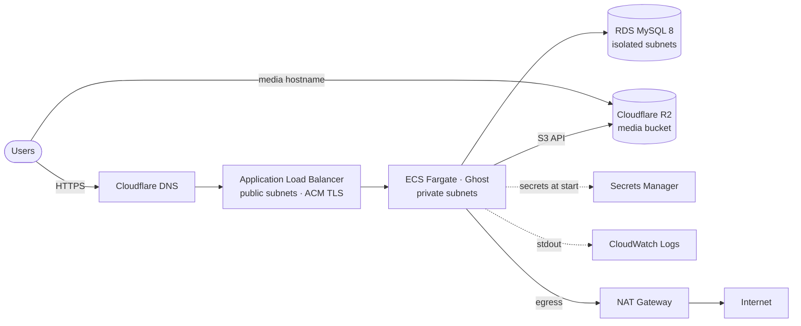
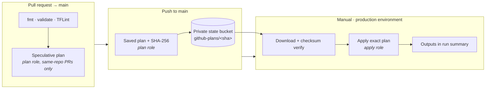

# Ghost on AWS — production-grade Terraform & GitOps

[](https://developer.hashicorp.com/terraform)
[](https://aws.amazon.com/)
[](.github/workflows)
[](https://developers.cloudflare.com/r2/)
[](LICENSE)

A complete, security-first deployment of the [Ghost](https://github.com/TryGhost/Ghost)
publishing platform on AWS, built as a portfolio project to demonstrate
production infrastructure practices: modular Terraform, keyless CI/CD through
GitHub OIDC, least-privilege IAM, and a plan-review-apply release gate.

> **Project status:** built, deployed end-to-end, and verified serving Ghost
> over HTTPS with media on Cloudflare R2 — then deliberately torn down to avoid
> idle cost. The repository is kept as a reference implementation; every
> resource here can be recreated from scratch with the steps below.

<!-- SCREENSHOT SLOT 1 — hero
     Suggested: the live Ghost site over HTTPS on the custom domain.
     
-->

## What this project demonstrates

| Area | What is here |
| --- | --- |
| **Infrastructure as Code** | Four reusable Terraform modules composed by a disposable application root and a persistent bootstrap root |
| **Network design** | Three-tier VPC: public ALB, private Fargate tasks behind a NAT gateway, fully isolated RDS subnets with no internet route |
| **Keyless CI/CD** | GitHub Actions authenticates to AWS with short-lived OIDC tokens; no access keys exist anywhere |
| **Least privilege** | Two IAM roles — a read-only *plan* role and a scoped *apply* role — with every action enumerated and trust bound to this repository's immutable numeric ID |
| **Release safety** | Pull requests get static checks and a speculative plan; `main` produces a saved plan; a human applies that *exact* plan after checksum verification |
| **Stateless compute** | Ghost runs as a single Fargate task with all uploads on Cloudflare R2, so tasks can be replaced without data loss |
| **Secrets handling** | Database credentials are generated by Terraform and injected from Secrets Manager at task start; nothing sensitive is in code, variables, or logs |

## Architecture



**Traffic path.** Cloudflare resolves the site hostname to the ALB. The ALB
terminates TLS with an ACM certificate, redirects HTTP to HTTPS, and forwards
to the Ghost task on port 2368. Ghost reaches MySQL over TLS inside the VPC.
Uploaded images and files go straight to R2 and are served from a Cloudflare
custom hostname, so the AWS side never stores user content.

**Security groups** are chained, not CIDR-based: the ALB accepts 80/443 from
the internet; the ECS group accepts 2368 *only from the ALB group*; the RDS
group accepts 3306 *only from the ECS group*. Database subnets have no route
to a NAT or internet gateway.

## CI/CD pipeline



<!-- SCREENSHOT SLOT 2 — pipeline
     Suggested: a green "Terraform production deployment" run showing the
     plan → apply jobs, or the run summary with the Terraform outputs.
     
-->

Why it is shaped this way:

- **The plan that is reviewed is the plan that is applied.** The binary plan
  is stored with a checksum and re-verified before apply; `terraform apply`
  never re-plans in CI. If state drifts in between, Terraform rejects the
  stale plan rather than silently doing something else.
- **Two roles, two environments.** The `plan` environment can only read state
  and describe resources. The `production` environment is restricted to
  `main`, holds the apply role, and requires a typed `APPLY` / `DESTROY`
  confirmation.
- **Forks are inert.** Workflows use `pull_request` (never
  `pull_request_target`), every PR job is gated on the PR coming from this
  repository, and the IAM trust policy matches the repository's numeric ID —
  a forked or transferred repo triggers nothing and cannot assume the roles.
- **Everything is pinned.** Actions by commit SHA, the Ghost image by manifest
  digest, Terraform and providers by version.

Workflow reference: [`.github/workflows/README.md`](.github/workflows/README.md)

## Repository layout

```
terraform/
├── bootstrap/          Persistent: state bucket, OIDC provider, CI roles (local state)
├── modules/
│   ├── network/        VPC, subnets, NAT, ALB, security groups
│   ├── data/           RDS MySQL, generated credentials, Secrets Manager
│   ├── compute/        ECS cluster, task definition, service, runtime IAM, logs
│   └── cicd/           GitHub OIDC provider and least-privilege plan/apply roles
├── main.tf             Disposable application root composing the modules
└── *.tfvars.example    Documented inputs; real tfvars are git-ignored
.github/workflows/
├── terraform-pr.yml        Static checks + speculative plan
├── terraform-apply.yml     Saved plan on push · manual plan / apply / output
└── terraform-destroy.yml   Manual, confirmed teardown
```

The split between `bootstrap` and the application root is deliberate:
destroying the Ghost stack can never delete the state bucket or the identity
CI needs to recreate it.

## Tech stack

- **Terraform** ≥ 1.15 with S3-native state locking (no DynamoDB table)
- **AWS**: VPC, ALB, ECS Fargate, RDS MySQL 8 (gp3, encrypted), Secrets Manager,
  CloudWatch Logs, ACM, IAM, S3
- **GitHub Actions** with OpenID Connect federation
- **Cloudflare**: DNS and R2 object storage with a custom media hostname
- **Ghost** 6.x official container image — [TryGhost/Ghost](https://github.com/TryGhost/Ghost)

## Deploying it yourself

Prerequisites: an AWS account, Terraform ≥ 1.15.8, a GitHub repository, an
issued ACM certificate for the site hostname, and a Cloudflare R2 bucket with a
custom domain and a bucket-scoped API token.

1. **Bootstrap once, locally** — creates the state bucket, OIDC provider, and
   CI roles. See [`terraform/bootstrap/README.md`](terraform/bootstrap/README.md).
2. **Store the R2 token** in AWS Secrets Manager as JSON with `accessKeyId`
   and `secretAccessKey` fields.
3. **Create two GitHub environments**, `plan` and `production`, and add the
   configuration variables listed in
   [`.github/workflows/README.md`](.github/workflows/README.md). Restrict
   `production` to the `main` branch.
4. **Open a pull request** — static checks and a speculative plan run.
5. **Merge to `main`** — a saved plan is produced and stored.
6. **Run *Terraform production deployment*** with `action=apply` and type
   `APPLY`. The ALB hostname is printed in the run summary.
7. **Point the site hostname at the ALB** with a Cloudflare CNAME (DNS-only, or
   proxied with SSL mode *Full (strict)*), then open `/ghost/` to create the
   owner account.

Teardown: run *Terraform production destroy* with `DESTROY`, then destroy the
bootstrap root locally.

## Scope and trade-offs

This is sized for a single operator and a small site, and some production
concerns were consciously left out to keep cost and complexity proportionate:

| Decision | Reason | What a larger deployment would add |
| --- | --- | --- |
| Single Fargate task | Ghost is designed around one writer; one task with R2 media is the safe default | Multiple tasks once every content path is external |
| Single NAT gateway | Halves the fixed monthly cost | One NAT per AZ |
| RDS single-AZ, 7-day backups | Adequate RPO for a blog; Multi-AZ doubles the DB cost | Multi-AZ, cross-region snapshots |
| No final DB snapshot on destroy | Sandbox stack; the apply role intentionally cannot create snapshots | Snapshot-on-delete with a retention policy |
| No WAF, no alarms | No production traffic to protect or page on | WAF managed rules, CloudWatch alarms, SNS |
| No email transport | Owner setup works without it | SES SMTP credentials in the task definition |

Fixed-cost components while running: ALB, NAT gateway, RDS `db.t4g.micro`,
one Fargate task (0.5 vCPU / 1 GiB). Roughly $60–70 per month in `us-east-1`
at the time of writing.

## Author

**Khaleeq Rehman** — DevOps / Cloud engineering

- GitHub: [@khaleeq-developer](https://github.com/khaleeq-developer)
- Website: [khaleeqrehman.com](https://khaleeqrehman.com)

## License

[MIT](LICENSE). Ghost is a trademark of the Ghost Foundation. This repository
deploys the official Ghost container image and contains no Ghost source code;
see [TryGhost/Ghost](https://github.com/TryGhost/Ghost) for the application
itself.
