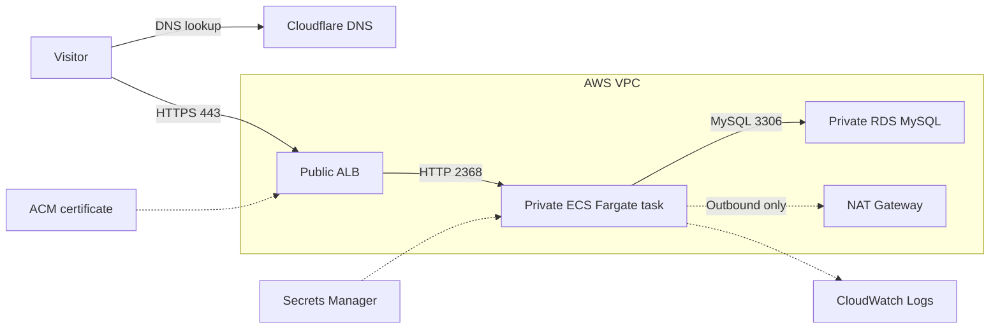

# Ghost on AWS with Terraform

A cost-conscious, production-style deployment of [Ghost](https://ghost.org/)
on AWS. The project is built incrementally: first a working private application
path, then durable media and stronger safeguards, and finally delivery
automation and operational evidence.

The repository contains infrastructure code only. Ghost runs from a pinned
container image and its source code is not copied or modified here.

## Current status

**Stage 1 is implemented:** an HTTPS request reaches an internet-facing
Application Load Balancer, which forwards it to one Ghost task running without
a public IP. Ghost stores application data in a private MySQL database.



Cloudflare is authoritative for DNS but is intentionally managed outside
Terraform. ACM terminates TLS at the ALB. Traffic from the ALB to Ghost remains
inside the VPC.

## Infrastructure

| Area | Current implementation |
| --- | --- |
| Network | One VPC across two Availability Zones |
| Public tier | Two public subnets, internet-facing ALB and one NAT Gateway |
| Application tier | Two private subnets available to one ECS Fargate task |
| Database tier | Two isolated subnets containing a single-AZ RDS MySQL instance |
| Access control | Security-group references between ALB, ECS and RDS |
| TLS | ACM certificate on an HTTPS listener; HTTP redirects to HTTPS |
| Secrets | Generated database credentials stored in AWS Secrets Manager |
| Logs | Ghost container output sent to CloudWatch Logs |
| State | Encrypted, versioned S3 backend with native S3 lockfile locking |

## Security boundaries

- The ALB is the only public application entry point.
- The ECS task has no public IP and accepts port `2368` only from the ALB
  security group.
- RDS is not publicly accessible and accepts port `3306` only from the ECS
  security group.
- The ECS execution role can retrieve only the database secret needed at
  startup.
- Private tasks reach image registries and AWS APIs through the NAT Gateway.
- HTTP requests are redirected to HTTPS using an issued ACM certificate.

Stage 1 deliberately favors learnability and low complexity over full high
availability. One NAT Gateway and one ECS task are availability limitations.

## Repository layout

```text
.
├── terraform/
│   ├── bootstrap/       # One-time S3 remote-state backend
│   ├── modules/
│   │   ├── network/     # VPC, subnets, routing, ALB and security groups
│   │   ├── data/        # RDS MySQL and database secret
│   │   └── compute/     # ECS cluster, task, service, IAM and logs
│   └── *.tf             # Single-environment root module
├── docker/              # Reserved for the Stage 2 custom Ghost image
├── monitoring/          # Reserved for Stage 3 operational assets
├── .github/workflows/   # Reserved for Stage 3 CI/CD
├── LICENSE
└── README.md
```

## Prerequisites

- An AWS account and credentials available to Terraform
- Terraform `>= 1.15.8`
- A domain whose DNS you can manage
- An issued ACM certificate in the same AWS Region as the ALB

Examples use `us-east-1` and `ghost.example.com`. Replace those values with
your own.

## Deploy

### 1. Create the remote-state bucket

The bootstrap configuration uses local state because the remote-state bucket
does not exist yet.

```bash
cp terraform/bootstrap/terraform.tfvars.example terraform/bootstrap/terraform.tfvars
# Set a globally unique state_bucket_name in the copied file.

terraform -chdir=terraform/bootstrap init
terraform -chdir=terraform/bootstrap plan
terraform -chdir=terraform/bootstrap apply
terraform -chdir=terraform/bootstrap output -raw state_bucket
```

Copy the resulting bucket name into `terraform/backend.tf`. Keep the bootstrap
state locally and securely; it is ignored by Git.

### 2. Request and validate the certificate

In AWS Certificate Manager, request a public certificate for the exact Ghost
hostname, such as `ghost.example.com`, in the deployment Region. Add the ACM
validation CNAME to Cloudflare as **DNS only**, then wait until ACM reports the
certificate as **Issued**. Keep that validation record for automatic renewal.

### 3. Configure local variables

```bash
cp terraform/terraform.tfvars.example terraform/terraform.tfvars
```

Set `domain_name` and `acm_certificate_arn` in the copied file. Real `.tfvars`
files are ignored because they can contain environment-specific or sensitive
values.

### 4. Review and apply the infrastructure

```bash
terraform -chdir=terraform init
terraform fmt -recursive
terraform fmt -check -recursive
terraform -chdir=terraform validate
terraform -chdir=terraform plan -out=stage1.tfplan
terraform -chdir=terraform show stage1.tfplan
terraform -chdir=terraform apply stage1.tfplan
```

Before applying, confirm that RDS has `publicly_accessible = false`, ECS has
`assign_public_ip = false`, and the plan contains no unexpected replacements or
deletions. Saved plan files may contain sensitive values and are ignored by
Git.

### 5. Point the hostname to the ALB

```bash
terraform -chdir=terraform output -raw alb_dns_name
```

Create a Cloudflare record using that output:

| Field | Value |
| --- | --- |
| Type | `CNAME` |
| Name | Ghost hostname label, such as `ghost` |
| Target | Terraform `alb_dns_name` output |
| Proxy status | Start with **DNS only** |

After direct HTTPS works, Cloudflare proxying can be enabled with SSL/TLS mode
set to **Full (strict)**.

## Verify

```bash
terraform -chdir=terraform output
curl -I https://ghost.example.com
```

The expected runtime state is one desired and running ECS task, one healthy ALB
target, a successful HTTPS response, and Ghost startup logs in the output
CloudWatch log group.

## Stage 1 limitations

- Uploads, custom themes and other files on the task filesystem are not durable.
- RDS is single-AZ and the ECS service runs one task.
- One zonal NAT Gateway serves both private application subnets.
- Outbound email, memberships, payments, CDN delivery and CI/CD are not
  configured.
- RDS deletion protection is disabled and teardown skips the final snapshot in
  this learning stage.

Do not store important media in Stage 1. Posts, settings and users persist in
RDS, but local files can disappear when the task is replaced.

## Roadmap

### Stage 2 — Durable and secure

- Build a reproducible Ghost image and publish it to ECR.
- Store Ghost media in a private, encrypted, versioned S3 bucket.
- Grant the task least-privilege access to that bucket.
- Deploy the image by immutable digest.
- Strengthen database deletion and snapshot safeguards.
- Prove that media and database content survive task replacement.

### Stage 3 — Portfolio complete

- Add GitHub Actions using OIDC instead of long-lived AWS keys.
- Add CloudFront and stronger origin protection.
- Add dashboards, alarms and actionable notifications.
- Test backup restoration and document recovery evidence.
- Record measured costs and architecture trade-offs.

## Teardown and cost

The ALB, NAT Gateway, RDS instance and Fargate task incur charges while they
exist. Destroy the main stack between learning sessions when availability is not
required:

```bash
terraform -chdir=terraform plan -destroy -out=destroy.tfplan
terraform -chdir=terraform show destroy.tfplan
terraform -chdir=terraform apply destroy.tfplan
```

Do not destroy the bootstrap bucket while it contains the main stack's state.
The bootstrap configuration protects the bucket from accidental Terraform
destruction.

## License and attribution

Infrastructure code is available under the [MIT License](LICENSE).

[Ghost](https://github.com/TryGhost/Ghost) is a trademark of the Ghost
Foundation. This project deploys the official Ghost container image and does
not include Ghost source code.
